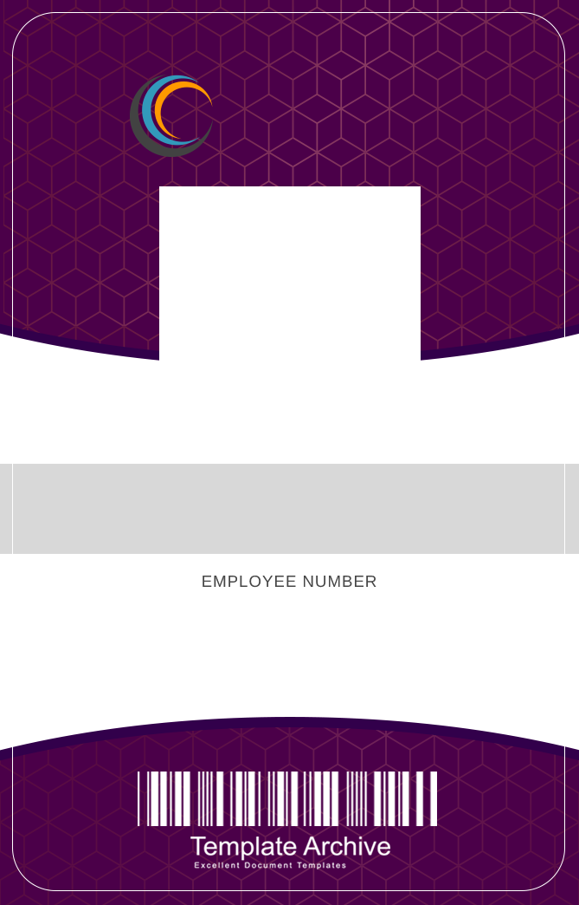

<a id="readme-top"></a>


<!-- Project Shields -->
[![Contributors][contributors-shield]][contributors-url]
[![Forks][forks-shield]][forks-url]
[![Stargazers][stars-shield]][stars-url]
[![Issues][issues-shield]][issues-url]
[![LinkedIn][linkedin-shield]][linkedin-url]


<!-- PROJECT LOGO -->
<br />
<div align="center">
  <a href="https://github.com/zbichsel/employee-badge-maker">
    
  </a>

  <h3 align="center">employee-badge-maker</h3>

  <p align="center">
    An excellent application to manage employee data!
  </p>
</div>


<!-- TABLE OF CONTENTS -->
<details>
  <summary>Table of Contents</summary>
  <ol>
    <li>
      <a href="#about-the-project">About The Project</a>
      <ul>
        <li><a href="#built-with">Built With </a></li>
      </ul>
    </li>
    <li>
      <a href="#getting-started">Getting Started</a>
      <ul>
        <li><a href="#prerequisites">Prerequisites</a></li>
        <li><a href="#installation">Installation</a></li>
      </ul>
    </li>
    <li><a href="#usage">Usage</a></li>
    <li><a href="#roadmap">Roadmap</a></li>
    <li><a href="#contributing">Contributing</a></li>
    <li><a href="#license">License</a></li>
    <li><a href="#contact">Contact</a></li>
    <li><a href="#acknowledgments">Acknowledgments</a></li>
  </ol>
</details>


<!-- ABOUT THE PROJECT -->
## About The Project

<!-- INSERT SCREENSHOT OF BADGE -->

Any Human Resources department will tell you the importance of having employee data available for reasons here or there, but as it pertains to this application, storing employee data is vital to having a record of their information PLUS the ability to create their credentials (ie, a badge).

Here's why:
* Remember the old days of having precut and flimsy cards? Sometimes they were illegible!
* We shouldn't have to deal with that in the year 2024, but in some places this practice still exists.
* We should have applications like the one here, where we can access employee information, and create legible, long-lasting employee badges.
* Might I add, we can also apply a picture with ease here!

<p align="right">(<a href="#readme-top">back to top</a>)</p>


## Built With


<p align="right">(<a href="#readme-top">back to top</a>)</p>


<!-- GETTING STARTED -->
## Getting Started

If this is your first time working with C#, you will need to download the extension on VS Code. Navigate to the extensions tab and search for C#, download the C# Dev Kit which will install C# and the .Net Install Tool.
Next you will need to download the .NET Core SDK from Microsoft.

To do this:
1. Navigate to [Microsoft Downloads](https://dotnet.microsoft.com/en-us/download).
2. Download the .NET 8.0 version, or which ever version is stable.
3. After downloading the correct installer, open the installer and it will guide you through the remaining steps to install .NET Core SDK.
4. To verify open the terminal and run the command `dotnet --version`.

### Dependencies

These are packages you will need if you close and run this application locally.
* dotnet
```sh
dotnet add package SkiaSharp --version 2.88.0
```
```sh
dotnet add package Newtonsoft.Json
```

### Installation

1. Clone the repo
```sh
git clone https://github.com/zbichsel/employee-badge-maker.git
```
2. Install the .Net packages
```sh
dotnet [insert package name]
```
3. Use the Random User Generator API to generate a quick list of people
```sh
https://randomuser.me/api/?results=10&nat=us&inc=name,id,picture
```
4. Remember to create Issues and new branches on Github to avoid pushing over previous code without evaluating differences
```sh
git checkout -b [new-branch]
```
```sh
git branch
```

<p align="right">(<a href="#readme-top">back to top</a>)</p>


<!-- USAGE EXAMPLES -->
## Usage

<!-- USE SCREEN RECORDING HERE -->
<p align="center">
<video src="./media/Screen Recording 2024-09-15 at 19.33.59.mp4" width="400" height="400" controls></video>
</p>


<p align="right">(<a href="#readme-top">back to top</a>)</p>


<!-- Contributing -->
## Contributing

If you have any suggestions that would make this easier and / or better, please fork this project and create a pull request. Also create an Issue if that fancies you. Thank you!

1. Fork the Project
2. Create a Feature Branch (`git checkout -b feature/yourfeature`)
3. Commit your Changes (`git commit -m "message about your feature"`)
4. Push to the Branch (`git push origin feature/yourfeature`)
5. Open a Pull Request
 
 <p align="right">(<a href="readme-top">back to top</a>)</p>


<!-- License -->
## License

Distributed under the MIT License. See `LICENSE` for more information.

[LICENSE](https://github.com/zbichsel/employee-badge-maker/blob/main/LICENSE)

<p align="right">(<a href="readme-top">back to top</a>)</p>


<!-- Contact -->
## Contact

Zackrey Bichsel - Biksel09@gmail.com

Project Link: [http://github.com/zbichsel/employee-badge-maker](https://github.com/zbichsel/employee-badge-maker)

<p align="right">(<a href="readme-top">back to top</a>)</p>


<!-- Acknowledgments -->
## Acknowledgments

* [https://github.com/othneildrew/Best-README-Template](https://github.com/othneildrew/Best-README-Template)

<p align="right">(<a href="readme-top">back to top</a>)</p>


<!-- MARKDOWN LINKS & IMAGES -->
<!-- https://www.markdownguide.org/basic-syntax/#reference-style-links -->
[contributors-shield]: https://img.shields.io/github/contributors/zbichsel/employee-badge-maker.svg?style=for-the-badge
[contributors-url]: https://github.com/zbichsel/employee-badge-maker/graphs/contributors
[forks-shield]: https://img.shields.io/github/forks/zbichsel/employee-badge-maker.svg?style=for-the-badge
[forks-url]: https://github.com/zbichsel/employee-badge-maker/network/members
[issues-shield]: https://img.shields.io/github/issues/zbichsel/employee-badge-maker.svg?style=for-the-badge
[issues-url]: https://github.com/zbichsel/employee-badge-maker/issues
[stars-shield]: https://img.shields.io/github/stars/zbichsel/employee-badge-maker.svg?style=for-the-badge
[stars-url]: https://github.com/zbichsel/employee-badge-maker/stargazers
[linkedin-shield]: https://img.shields.io/badge/-LinkedIn-black.svg?style=for-the-badge&logo=linkedin&colorB=555
[linkedin-url]: https://linkedin.com/in/zackrey-bichsel
